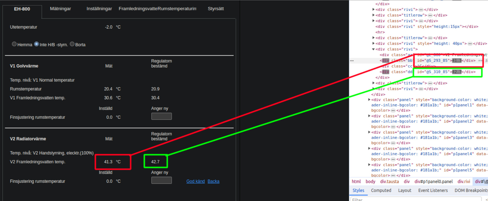

# Ouman EH-800 - Home Assistant integration

##
### Introduction:

This how-to is all about using the Ouman EH-800 heating controller with Home Assistant. Ouman EH-800 is a versatile and very popular heating controller in Finland for heating systems using water as transfer medium, both for radiators and floor heating.

More information, manuals and so on can be found here https://ouman.fi/en/product/ouman-eh-800-and-eh-800b/


### Credits:

[Home Assistant Forum](https://community.home-assistant.io/t/how-to-control-your-ouman-eh-800-heating-controller-using-home-assistant/445244)

Please visit the link above for help and further discussions, I just decided to try and keep all information collected in a good way since the forum-post has gotten quite messy over time, I will do my best to keep this page up to date with new changes if there are any.
A special thanks goes out to all the people over at the Home Assistant forum for figuring all this out!

##
### Prerequisites:

Ouman EH-800 controller, connected to Ethernet (EH-800B won’t do, it has no Ethernet)

IP address, username and password configured in EH-800 (please consult the manual how to configure this)

Basic knowledge about Home Assistant configuration files and tools

Your EH-800 is properly configured and working

##


##
### Configuration needed in Home Assistant

1. First of all we need to add a shell command /homeassistant/configuration.yaml

You need to replace ip, port, username & password with the values you configured in your EH-800!

```
shell_command:
    ouman_logon: 'curl "http://ip.ip.ip.ip:port/login?uid=USERNAME;pwd=PASSWORD;" > /dev/null'
```

2. Create an automation that logs into EH-800 “every now and then”, the exact time out is unknown but for me 20 minutes work just fine.

```
alias: Log on to Ouman-EH-800
trigger:
  - platform: time_pattern
    minutes: "20"
    alias: Log on every 20 minutes
condition: []
action:
  - service: shell_command.ouman_logon
    data: {}
mode: single
```

3. Then create all the sensors / switches you want under /homeassistant/configuration.yaml

Here is an example of a sensor and a switch (You need to replace ip and port with our configured values)

```
command_line:
  - sensor:
        name: Ouman EH-800 - Temperature Outside
        command: 'curl "http://ip.ip.ip.ip:port/request?S_227_85" | cut -d '';'' -f 1 | cut -b 18-'
        unit_of_measurement: "°C"
        state_class: measurement
        unique_id: 72711022-8cb5-4c40-8a49-f24655e62f96

  - switch:
      name: Ouman EH-800 - Home / Away (Off = Away // On = Home)
      command_on: curl "http://ip.ip.ip.ip:port/update?S_135_85=0;"
      command_off: curl "http://ip.ip.ip.ip:port/update?S_135_85=1;"
      scan_interval: 120
      command_state: curl http://ip.ip.ip.ip:port/request?S_135_85 --output - | cut -d ';' -f 1 | cut -b 18-
      value_template: >
        
            true
        
            false
         
      unique_id: 88ee5406-39ce-448e-a842-c7fc16efab2f
```

4. As a last step you need to restart Home Assistant for all this to take effect (or at least reload "Command Line Entities" / "All YAML onfiguration" under Developer tools)


If you want to create your own sensors / switches you need to know the correct registers.


##
### Registers

To see a reference table of known registers please look at the the following file [Registers](registers.txt)

If the register you are looking for is not documented, you can try and find it by inspecting the web interface of the EH-800, below is a quick "guide" how you can do that.
If you can't find the register you are looking for, please visit the [Home Assistant Forum](https://community.home-assistant.io/t/how-to-control-your-ouman-eh-800-heating-controller-using-home-assistant/445244) to ask for help.


